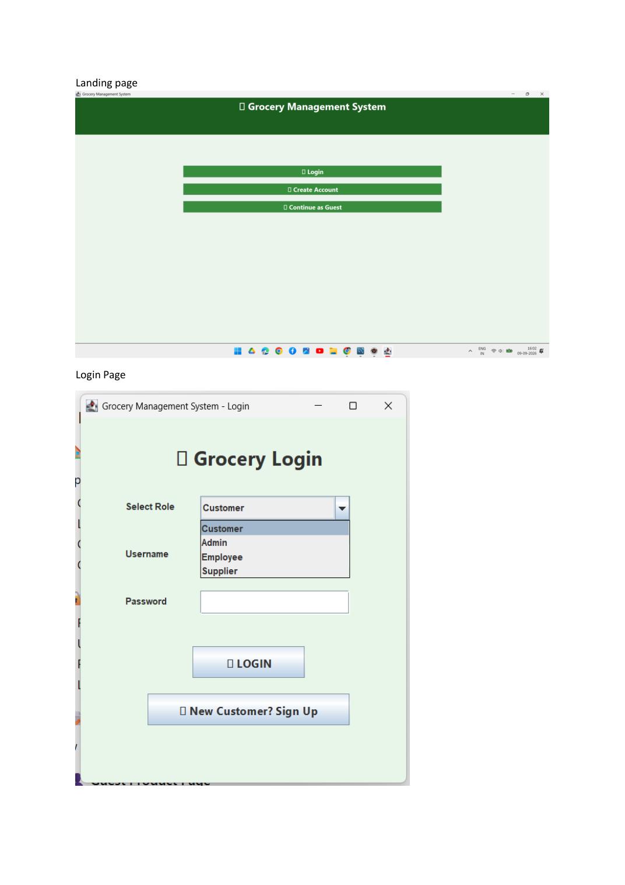
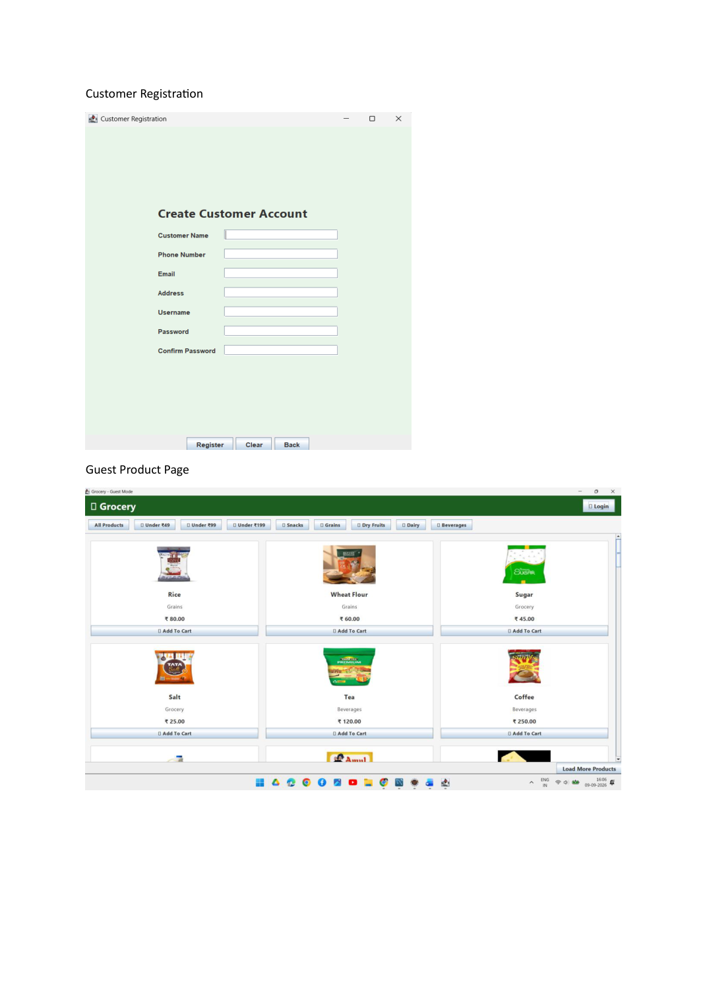
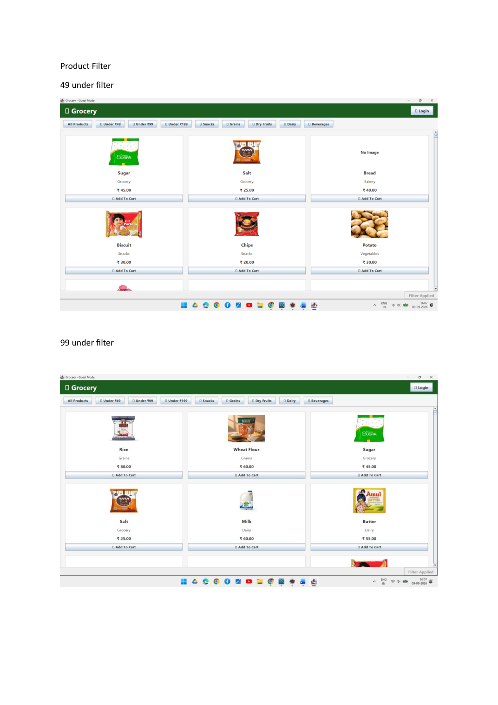
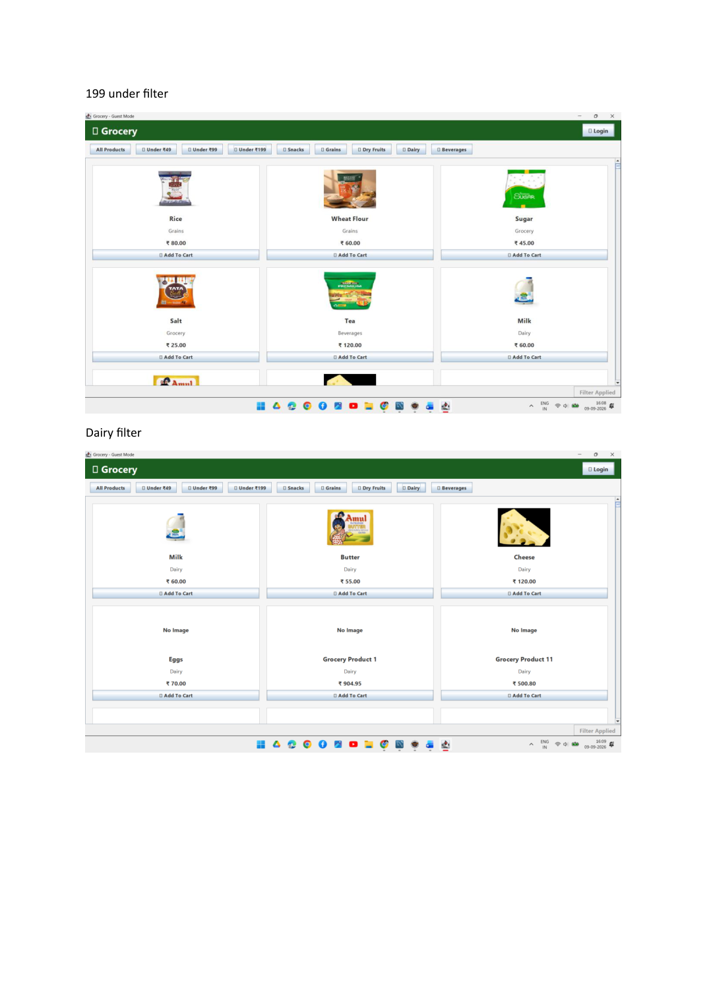
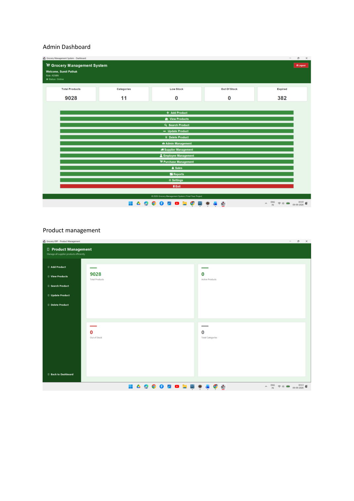
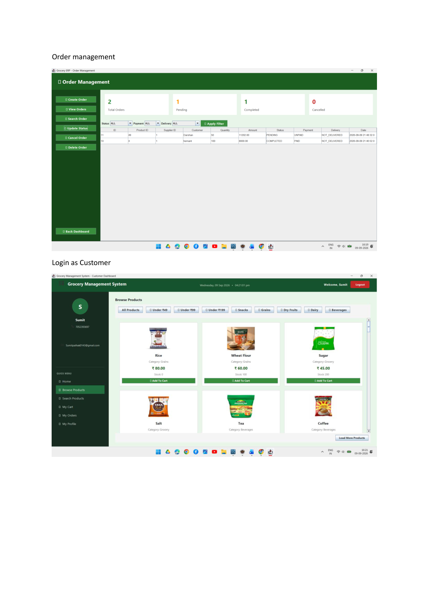
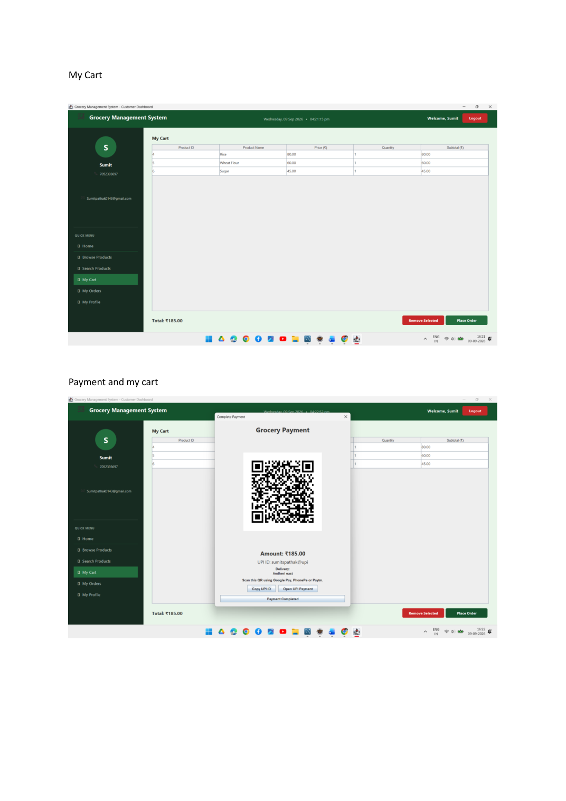
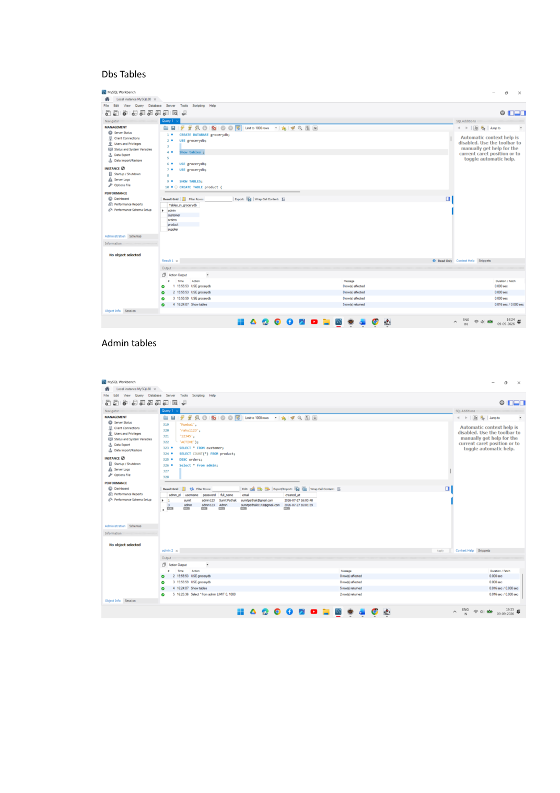
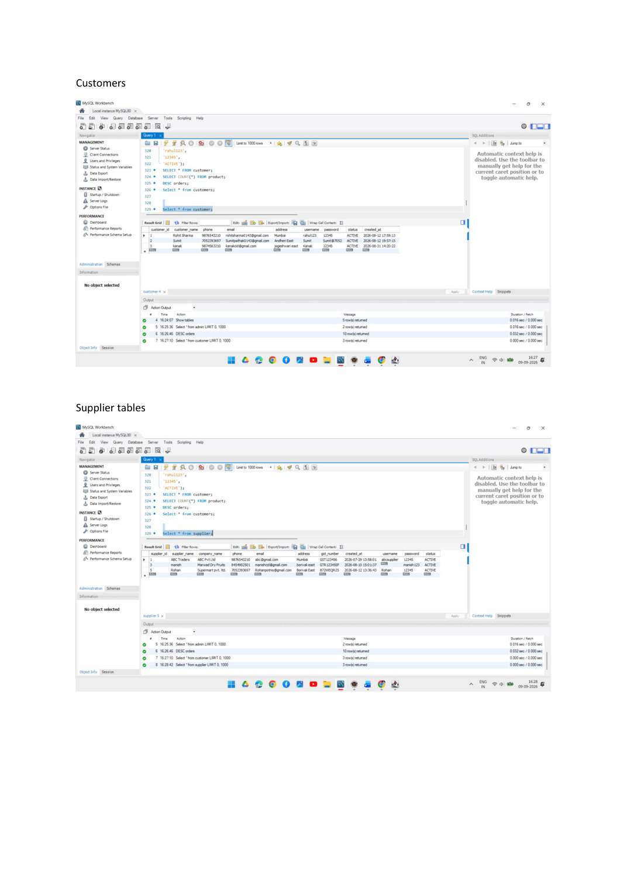

# 🛒 Grocery Management System

A Java-based Grocery Management System designed to manage products, inventory, customers, and billing operations using a MySQL database.

## 📌 About The Project

The Grocery Management System is a desktop/web-based inventory and billing application developed using Java and MySQL. It helps manage grocery products, maintain stock information, register customers, search products, and generate customer bills.

The project follows a structured architecture with database connectivity through JDBC and Maven for dependency management.

## ✨ Features

- 🏪 Product Management
- 📦 Inventory & Stock Management
- 🔍 Product Search
- 👤 Customer Registration
- 🧾 Customer Billing
- 💰 Bill Generation
- 🗄️ MySQL Database Integration
- 🖼️ Product Image Management
- 📊 Product & Stock Information
- 🔐 Application Login / Access Management

## 🛠️ Technologies Used

| Technology | Purpose |
|---|---|
| Java | Core application development |
| Java Swing | User interface |
| JDBC | Database connectivity |
| MySQL | Data storage |
| Maven | Project and dependency management |
| JSP | Web interface components |
| HTML/CSS | Web presentation |

## 🏗️ Architecture

The application separates user-interface, business logic, and database-related operations to keep the project organized and maintainable.

```text
User Interface
      ↓
Application / Business Logic
      ↓
DAO / Database Operations
      ↓
JDBC
      ↓
MySQL Database


## 📸 Screenshots

### Landing Page


### Login Page


### Dashboard


### Product Management


### Customer Management


### Product View


### Inventory


### Billing


### Database / Management


## 🚀 Setup & Installation

### 1. Clone the Repository

    git clone https://github.com/SumitSPathak/grocery-management-system.git

### 2. Open the Project

Import the project into Eclipse as an existing Maven project.

### 3. Configure MySQL

Update your MySQL database credentials in:

    src/main/resources/application.properties

### 4. Install Dependencies

Maven will automatically download the required dependencies from `pom.xml`.

### 5. Run the Application

Run the application from Eclipse.

## 🎯 Project Objectives

- Automate grocery inventory management
- Manage products and stock
- Maintain customer information
- Generate customer bills
- Store application data using MySQL
- Reduce manual work

## 🔮 Future Enhancements

- Online payment integration
- Role-based authentication
- Sales analytics dashboard
- Low-stock notifications
- Cloud database support
- REST API integration
- Responsive web interface

## 👨‍💻 Author

**Sumit Pathak**

B.E. Information Technology  
Shree L. R. Tiwari College of Engineering, Mumbai
